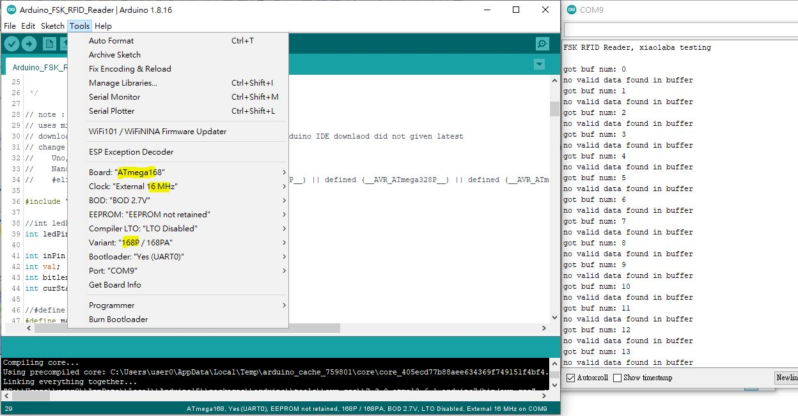
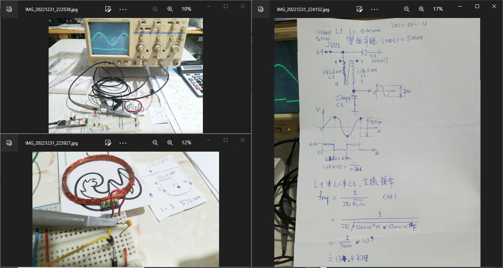
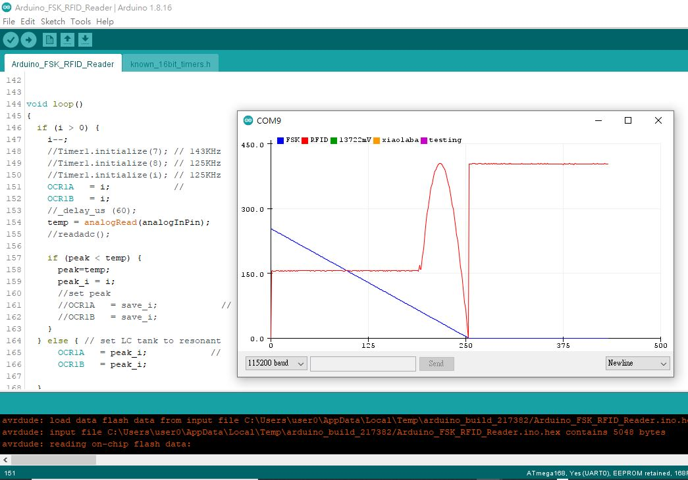

# ATmega168P_Arduino_FSK_RFID_Reader  
clone and port to atmega168p, modified source code get rid of some memory constraints.    


source code copt from, https://gist.github.com/rgerganov/c8cec1f2c498c1e0786084bfdc1240b7  
design copy from, https://playground.arduino.cc/Main/DIYRFIDReader/  
it says GNU license  

uses Arduino IDE to complie, mini core used, add 168P support  
download and install the latest timerOne form github, Arduino library is not the latest one.  
https://github.com/PaulStoffregen/TimerOne  
install to C:\Users\user0\Documents\Arduino\libraries\TimerOne  
edit C:\Users\user0\Documents\Arduino\libraries\TimerOne\config\known_16bit_timers.h
add 168p support,  
```
//    Uno, Duemilanove, LilyPad, etc
//    Nano, some uses 168P , by xiaolaba
//    #elif defined (__AVR_ATmega168__) || (__AVR_ATmega168P__) || defined (__AVR_ATmega328P__) || defined (__AVR_ATmega328__) ||  defined (__AVR_ATmega8__)add atmega168P to support TIMER1_PINA

```

or copy [known_16bit_timers.h](known_16bit_timers.h) of this repo to patch.  

### testing done,
  

### [143KHz_LC_tank_testing](143KHz_LC_tank_testing)  
LC tank tune to resonant frequency
https://www.omnicalculator.com/physics/resonant-frequency-lc
  

the peak of adc readout is telling resonant frquency tunned,  
  


peak detector algorithm
```

uint8_t i=255, peak_i=0;
uint32_t temp=0, peak=0;


void readadc()
{
    temp = analogRead(analogInPin);
    Serial.print(i, DEC); Serial.print(",");
    Serial.print(temp); Serial.print(",");
    Serial.print(temp*1253*278/10230); Serial.println("mV");

}


void loop()
{  
  if (i > 0) {  // i decreament from 255 to 0
    i--;
    //Timer1.initialize(7); // 143KHz  
    //Timer1.initialize(8); // 125KHz 
    //Timer1.initialize(i); // 125KHz
    OCR1A   = i; // PWM factor of Timer1, greater value, lower PWM frequency
    OCR1B   = i; // PWM factor of Timer1, greater value, lower PWM frequency
    //_delay_us (60);
    temp = analogRead(analogInPin);  
    if (peak < temp) {
      peak=temp; // save peak voltage
      peak_i = i;// save PWM factor
    }
  } else { // set LC tank to resonant frequency
      OCR1A   = peak_i;            // 
      OCR1B   = peak_i;
  }

  readadc();
  }
```
